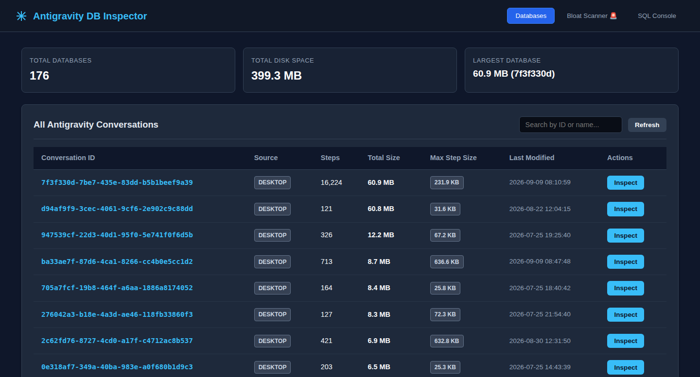
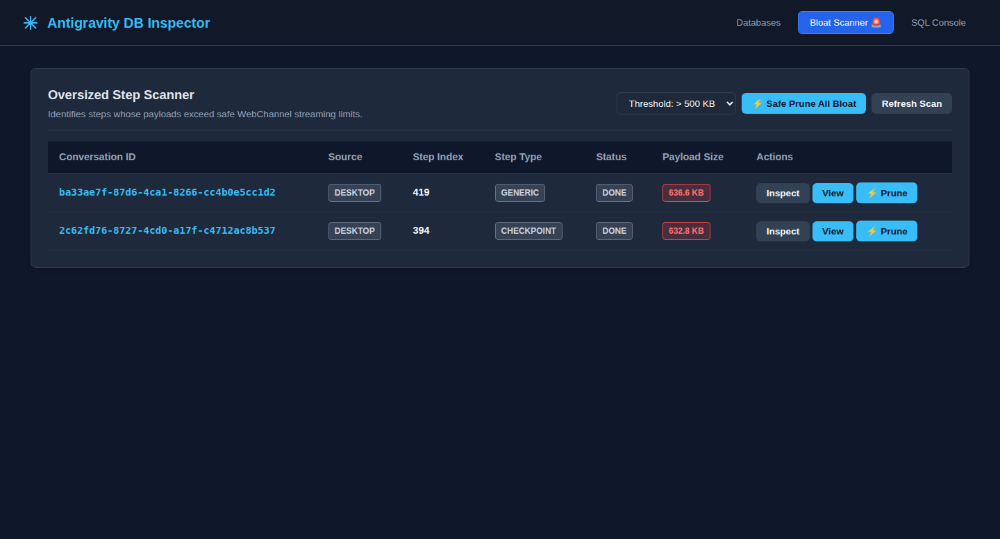
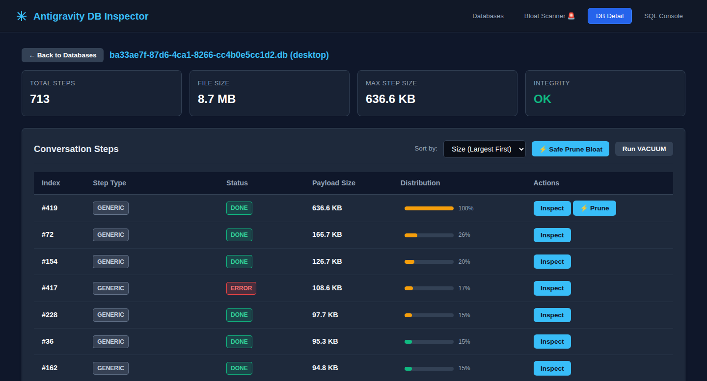
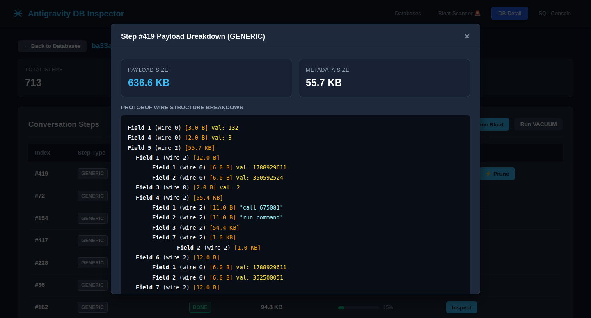
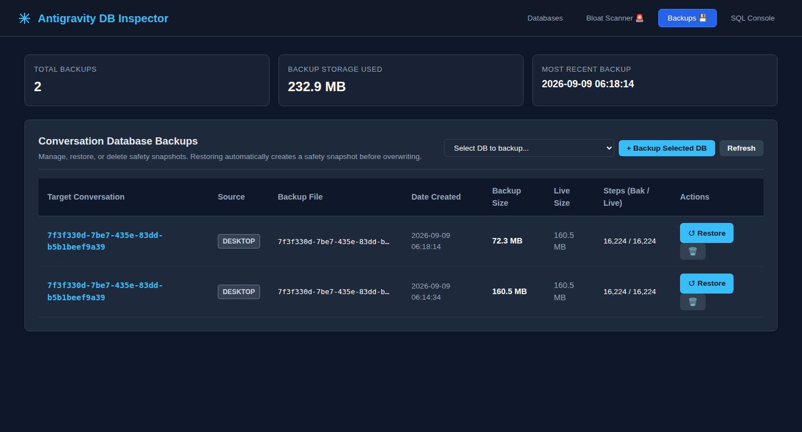

# Antigravity SQLite Database Inspector

> A lightweight, zero-dependency local web dashboard and diagnosis tool for **Google Antigravity** SQLite databases on Linux (Ubuntu / Debian).

[](https://www.python.org/)
[]()
[]()
[]()

---

## 🎯 Overview

Antigravity stores all active workspaces, conversation trajectories, step logs, and tool execution history inside local SQLite databases (`.db` files). 

When working on large codebases, huge data snapshots (such as 20 MB+ JSON files, raw bundle dumps, or repetitive terminal logs) can get captured inside step payloads. Over Google WebChannel remote connections, streaming these multi-megabyte payloads causes transfer buffer timeouts and disconnection loops.

**Antigravity DB Inspector** gives you full visibility into your Antigravity conversation databases, pinpointing oversized payloads, decoding binary protobuf wire data, and safely pruning bloat with 1-click — **without losing any conversation context, messages, or reasoning**.

---

## 📸 Screenshots

| Database Overview | Bloat Scanner |
|:---:|:---:|
|  |  |

| Step Size Breakdown & Distribution | Protobuf Wire Decoder Modal |
|:---:|:---:|
|  |  |

| Backup Manager Dashboard | |
|:---:|:---:|
|  | |

---

## ✨ Features

- **🔍 Automatic Database Discovery**: Automatically scans and monitors all conversation databases across both the Desktop IDE and CLI daemon.
- **🚨 Bloat Scanner**: 1-click scanner that detects steps exceeding configurable thresholds (250 KB / 500 KB / 1 MB) that threaten WebChannel remote connections.
- **🛡️ Protected Trajectory States**: Strictly protects internal state machine checkpoints (`CHECKPOINT` type 23) and conversational dialog turns (`USER_INPUT`, `PLANNER_RESPONSE`) from pruning to ensure pre-invocation deserialization never fails.
- **⚡ 1-Click Safe Prune**: Surgically replaces oversized raw file snapshots and massive tool outputs with compact placeholders.
  - **Zero Context Loss**: Preserves 100% of user prompts, agent reasoning, execution plans, tool call arguments, and file paths.
  - **Safety First**: Automatically creates a timestamped `.bak_<timestamp>` backup before modifying any database file.
  - **Instant Reclamation**: Automatically runs `VACUUM` and `PRAGMA integrity_check` to eliminate fragmented disk pages.
- **💾 Dedicated Backup Manager**: Full visibility and management of all safety snapshots across Desktop and CLI folders.
  - **1-Click Safe Restore**: Restores any backup while automatically generating a `.pre_restore_<timestamp>` snapshot of the live DB first.
  - **Manual Snapshots**: 1-click "Backup Now" button on any conversation from the table or detail view.
  - **Storage Cleanup**: Delete outdated backups with 1-click to reclaim disk space.
- **🔬 Protobuf Wire Format Decoder**: Unpacks binary BLOBs from the `steps.step_payload` column into fields, wire types, sub-message hierarchies, and UTF-8 string previews.
- **💻 Interactive SQL Console**: Run ad-hoc SQL queries with one-click presets (`PRAGMA integrity_check`, `Top 20 Largest Steps`, `Show Schema`).
- **🧹 Storage Maintenance**: 1-click `VACUUM` on any database to reclaim disk space.

---

## 📦 Dependencies

**Zero external dependencies.** Built entirely using Python's standard library:
- `python3` (>= 3.8)
- `python3-sqlite3` (standard library SQLite driver)

No `pip install`, virtual environment, or external packages required.

---

## 🚀 Installation (Ubuntu / Linux)

### 1. Clone the Repository
```bash
git clone git@github.com:CatoPaus/antigravity-db-inspector.git ~/lab/antigravity-db-inspector
cd ~/lab/antigravity-db-inspector
```

### 2. Run the Installer
```bash
./install.sh
```

The installer verifies your Python installation, checks Antigravity database paths, and creates a global launcher in `~/.local/bin/antigravity-db-inspector`.

### Installation Options
| Command | Description |
| :--- | :--- |
| `./install.sh` | Standard install to `~/.local/bin` (no `sudo` required) |
| `sudo ./install.sh --global` | System-wide install to `/usr/local/bin` |
| `./install.sh --service` | Installs and enables a background `systemd` user service (starts on login) |
| `./install.sh --uninstall` | Cleanly removes launcher and systemd service |

---

## 🔍 How Databases Are Automatically Discovered

On Linux (Ubuntu), Antigravity places conversation databases in specific user directories:
1. **Desktop App**: `~/.gemini/antigravity/conversations/*.db`
2. **CLI Daemon (`agy`)**: `~/.gemini/antigravity-cli/conversations/*.db`

When launched, the inspector automatically searches both directories and summarizes what it found:
```text
==================================================
 Antigravity SQLite Database Inspector
 Web UI running at: http://localhost:8990/
 Listening on:      0.0.0.0:8990

 Discovered Database Locations:
   [desktop] /home/cato/.gemini/antigravity/conversations (174 DBs)
   [cli    ] /home/cato/.gemini/antigravity-cli/conversations (2 DBs)
==================================================
```

### Custom Database Directories
To scan custom or backup directories, pass `--db-dir` or set the `ANTIGRAVITY_DB_DIRS` environment variable:
```bash
antigravity-db-inspector --db-dir /path/to/my/backups --db-dir /another/folder
```
Or:
```bash
export ANTIGRAVITY_DB_DIRS="/path/one:/path/two"
antigravity-db-inspector
```

---

## 🖥️ Usage

### Starting the Server
Simply run:
```bash
antigravity-db-inspector
```
Or specify custom port and host:
```bash
antigravity-db-inspector --port 9000 --host 127.0.0.1
```

### Accessing the Dashboard
- **Locally on Ubuntu**: Open [http://localhost:8990](http://localhost:8990) in your browser.
- **Remotely from Another Machine (e.g., Windows PC on same LAN)**:
  Open `http://<ubuntu-ip-address>:8990` in Google Chrome.

---

## 🛡️ Safety & Concurrency Rules

Antigravity operates in SQLite **WAL (Write-Ahead Logging)** mode:
* **Browsing, Bloat Scanning, & SQL `SELECT`**: 100% safe to run while Antigravity is open. Readers do not block writers.
* **Pruning Inactive Conversations**: 100% safe to run anytime. Antigravity only holds open file locks on the currently active chat.
* **Pruning the Currently Active Chat**: You can prune it while open, but it is recommended to restart Antigravity (`Ctrl+Q` and reopen) so it drops its in-memory RAM cache and reloads the newly slimmed database from disk.

---

## 📄 License

MIT License. Feel free to use and contribute!
